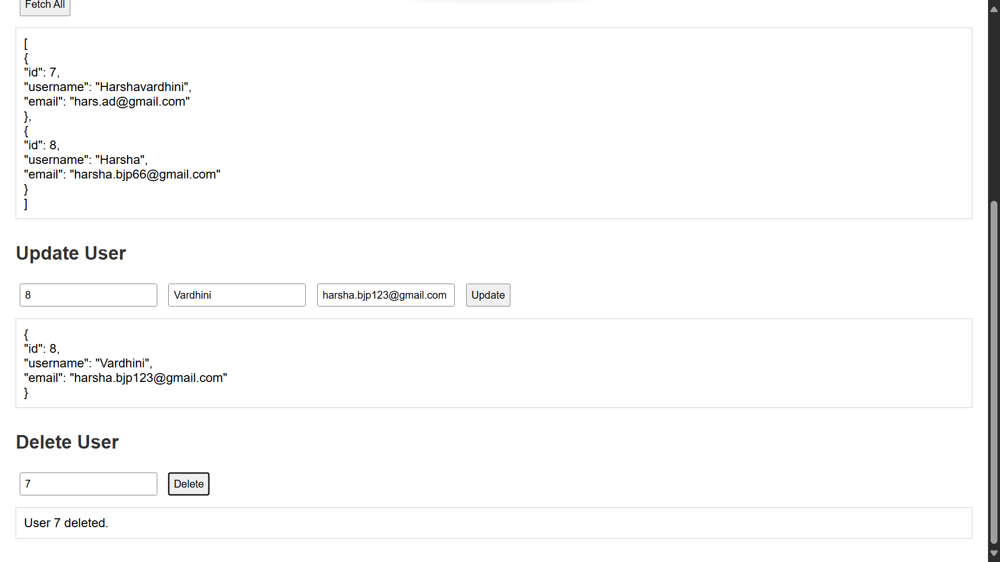

# Digital Consent Vault

This is a simple web application built with Spring Boot and HTML/CSS. It allows users to perform basic CRUD (Create, Read, Update, Delete) operations on user data through a clean interface and REST API endpoints. The frontend is a static HTML page, and the backend is a Spring Boot application.

---

## Features

- Add new users (POST)
- View all users (GET)
- View user by ID (GET)
- Update user information (PUT)
- Delete users (DELETE)
- HTML interface to test the operations
- Integrated Spring Security (basic config)

---

## Project Structure

digital-consent-vault/
├── src/
│ ├── main/
│ │ ├── java/
│ │ │ └── com.consentvault.digital_consent_vault/
│ │ │ ├── controller/
│ │ │ ├── model/
│ │ │ ├── repository/
│ │ │ └── service/
│ │ └── resources/
│ │ ├── static/
│ │ │ └── user_crud.html
│ │ └── application.properties
├── pom.xml
└── README.md

---

## How to Run Locally

1. **Clone the repository:**
   ```bash
   git clone https://github.com/HARSHAVARDHINI-11/digital-consent-vault.git
   cd digital-consent-vault
   ```

### Build the Project

mvn clean install

### run the application

java -jar target/digital-consent-vault-0.0.1-SNAPSHOT.jar

### Acess app in the browser

http://localhost:8080/user_crud.html

### REST API Endpoints

| Method | Endpoint          | Description       |
| ------ | ----------------- | ----------------- |
| POST   | `/api/users`      | Create a new user |
| GET    | `/api/users`      | Get all users     |
| GET    | `/api/users/{id}` | Get user by ID    |
| PUT    | `/api/users/{id}` | Update user by ID |
| DELETE | `/api/users/{id}` | Delete user by ID |

### Author

Developed by Harshavardhini
GitHub: HARSHAVARDHINI-11

### What to Do Next

1. Save this content in a file named `README.md` at the root of your project folder.
2. Then run these Git commands:
   ```bash
   git add README.md
   git commit -m "Added project README with usage and deployment steps"
   git push origin main
   ```

## Screenshots

### 🔹 User Form Interface



